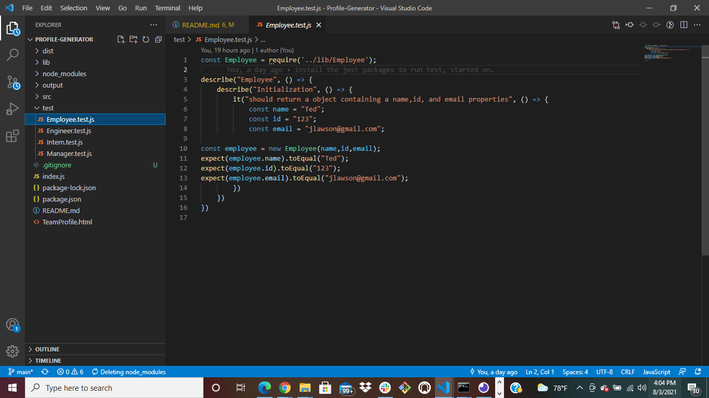

# Profile-Generator

.png)
.png)
.png)

## Table of Contents

*[Profile-Generator](#Profile-Generator)
*[Description](#Description)
*[Installation](#Installation)
*[Test](#Test)
*[Walk-Through](#Walk-Through)

## Description

*This is a Node.js command-line application that takes in information about employees on a software engineering team.
*Then the app generates an HTML webpage that displays summaries for each person.
*As a manager of this app, you can generate a webpage that displays your team's basic info.
*Info will ask for quick access to their emails and GitHub profiles.

## Installation

* This application installs:
* node
* node modules
* jest
* inquirer packages
* npm packages
* JSON packages
* .gitignore

## Test

.png)
.png)
.png)

## Walk-Through
https://drive.google.com/file/d/1V0s5I5h5VqeskOqkS_4WUl9QRVxq0zU3/view?usp=sharing
https://drive.google.com/file/d/1s6JD2u9qWCrUG1Gv_U4rU59lx-Z_tyoj/view?usp=sharing